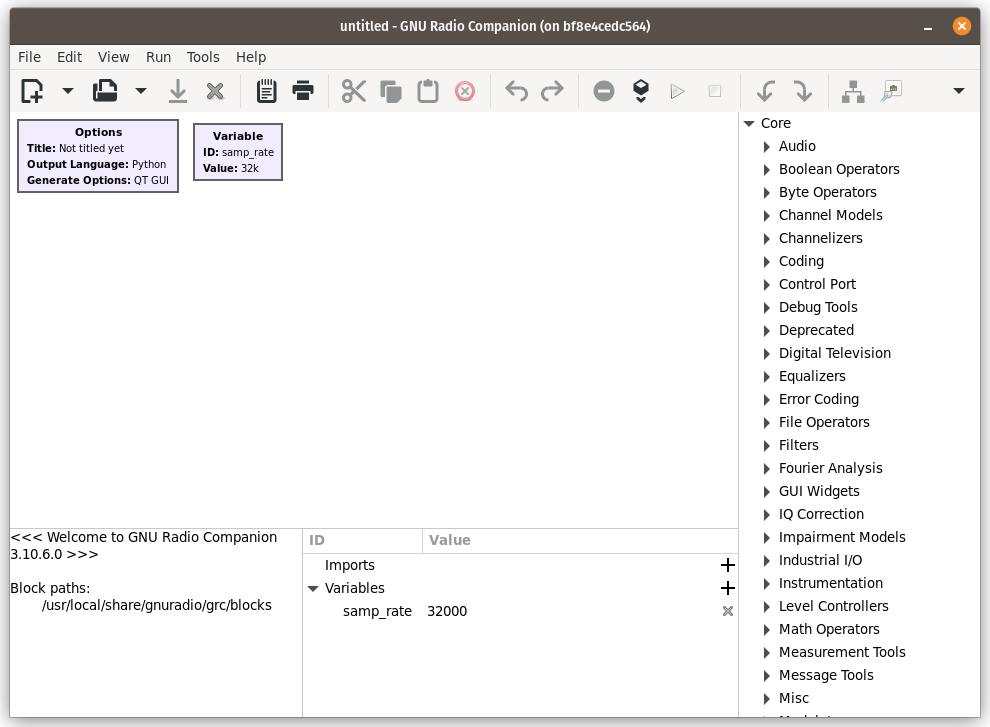

# Zero-IF Labs Docker Images

Dockerfiles for GNU Radio 3.10 and other SDR-related things on Ubuntu 22.04.

## Docker Installation

1. installation: https://docs.docker.com/engine/install/ubuntu/
2. post-installation tasks: https://docs.docker.com/engine/install/linux-postinstall/

## Building Images

Each directory has build scripts (either `clean_build.sh` or the incremental `build.sh`). Build images in the following order:

Order | Image(s) | Description
----- | -------- | -----------
1st | `sdrs` | [UHD](https://github.com/EttusResearch/uhd) and the [Signal Hound SDK](https://signalhound.com/software/signal-hound-software-development-kit-sdk/)
2nd | `gnuradio310` | [VOLK](https://github.com/gnuradio/volk), [GNU Radio](https://github.com/gnuradio/gnuradio) 3.10, and several OOT modules
3rd | `xxx` | project-specific images (in other repositories)

The base image (`sdrs`) will also set up a non-root user with `sudo` access whose name is derived from the host user - this is all handled automatically through the build scripts. Be sure to run the `udev.sh` script to install udev rules on the host (which will allow non-sudo access of SDR hardware inside the container).

## Running

Allow docker containers to connect to the host X11 server. It's best to just add this to the host `~/.bashrc` file.
```
xhost +local:docker
```

The [gnuradio310/)](gnuradio310/) directory contains example run scripts that show how to start a container based on these images. Once inside the container, open GNU Radio Companion:

```bash
dev@2b310945025e:~$ gnuradio-companion
```

And the GUI should come up:


