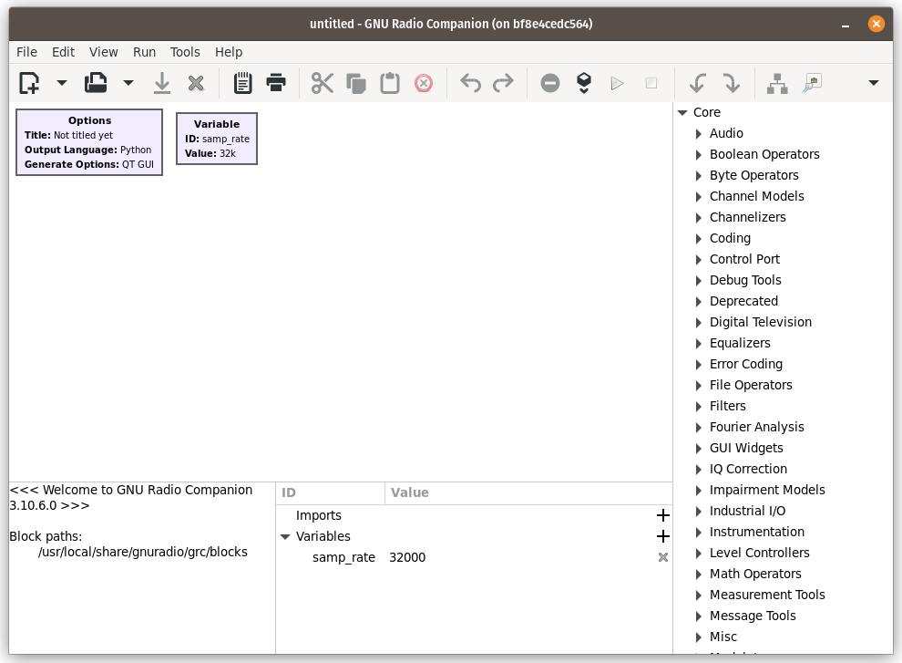
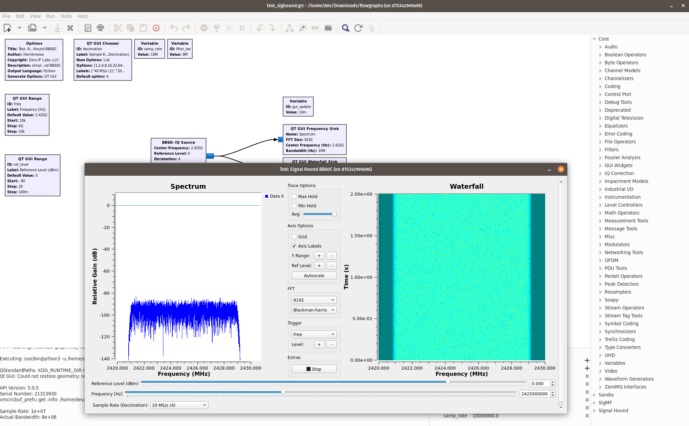

# Zero-IF Labs Docker Images

Dockerfiles for GNU Radio 3.10 and other SDR-related things on Ubuntu 22.04.

## Docker Installation

1. installation: https://docs.docker.com/engine/install/ubuntu/
2. post-installation tasks: https://docs.docker.com/engine/install/linux-postinstall/

## Building Images

Install the `udev` rules to allow non-root USB access of SDR hardware inside the containers:

```bash
cd sdrs/udev
./udev.sh
```

Each directory has build scripts (either `clean_build.sh` or the incremental `build.sh`). The base image (`sdrs`) will also set up a non-root user with `sudo` access whose name is derived from the environment variable `DOCKER_USER`. Build images in the following order:

Order | Image(s) | Description
----- | -------- | -----------
1st | `sdrs` | [SDRplay](https://www.sdrplay.com/products/) drivers/API, [UHD](https://github.com/EttusResearch/uhd) and the [Signal Hound SDK](https://signalhound.com/software/signal-hound-software-development-kit-sdk/)
2nd | `gnuradio310` | [VOLK](https://github.com/gnuradio/volk), [GNU Radio](https://github.com/gnuradio/gnuradio) 3.10, and several OOT modules
3rd | ??? | project-specific images (in other repositories)

A convenience script is provided to build both images:

```bash
DOCKER_USER=johndoe ./clean_build_all.sh
```

## Running

Allow docker containers to connect to the host X11 server. It's best to just add this line to the host `~/.bashrc` file.
```
xhost +local:docker
```

Both the [sdrs/](sdrs/) and [gnuradio310/](gnuradio310/) directories contain `run.sh` scripts that shows how to start containers. By default, they create the directory `/tmp/dockershared/` and volume mount it into the container.

Once inside the container, open GNU Radio Companion:

```bash
dev@bf8e4cedc564:~$ gnuradio-companion
```

And the GUI should come up:



There are also flowgraphs in `gnuradio310/flowgraphs/` that can be `docker cp`-ed (or volume mounted) into the container.

